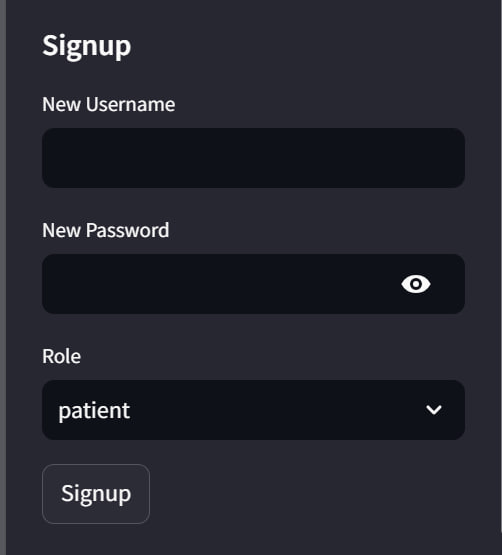

# 🩺 GenAI-Powered Medical Diagnosis

A role-based medical diagnosis system built with **Streamlit (frontend)** and **FastAPI (backend)**.  
Patients can upload prescriptions/reports, view diagnosis history, and receive **AI-powered diagnostic insights**. Doctors (with valid ID) can review any patient's reports/history and add recommendations.

---

# 🚀 Features

## 👤 Patient
- Signup & login with role = `patient`.
- Upload prescriptions/reports (PDF, TXT, JPG/PNG).
- Get AI-powered diagnostic insights for each uploaded report.
- View personal medical history & previous diagnoses.

## 🩺 Doctor
- Signup/login with role = `doctor` (requires a valid doctor ID verification).
- Access and review any patient's medical reports and history.
- Provide recommendations/notes for a patient's report.

---

🛠 Tech Stack
Frontend: Streamlit

Backend: FastAPI (uvicorn)

Database: MongoDB

AI : LangChain + LLM (Llama3 / OpenAI / Ollama)

OCR / Parsing: pytesseract, pdf2image, pdfminer.six

Auth: JWT

🖼️ Screenshots

